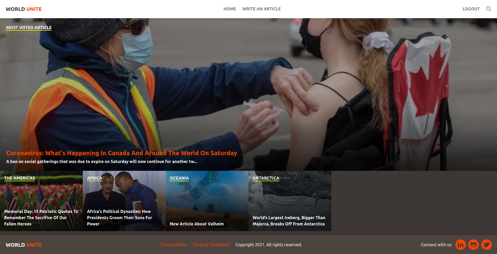

# Microverse RoR Capstone: liFEsTlye (World Unite)

> [liFEsTlye](https://www.behance.net/gallery/14554909/liFEsTlye-Mobile-version) is an articles pages where readers can get their daily dose of content, according to their categories. For this capstone, we had to create our own Article app, that I named **World Unite**, where we can get news from each and every continent of the world.

Original design by [Nelson Sakwa](https://www.behance.net/sakwadesignstudio).

## Built With

- Ruby >= 3.0.0
- Ruby on Rails >= 6.1.3.1
- Rails Active Storage
- Bulma Framework

## Live Demo

[World Unite on Heroku](https://world-unite.herokuapp.com)

## Getting Started

### Prerequisites

- A github account
- Ruby and Ruby on Rails installed on your computer
- A terminal with your github account logged in

### Setup

- Use your github account and your terminal to clone this repository to your computer:

`git clone https://github.com/fernandorpm/lifestyle-articles.git`

- Go to the cloned directory:
`cd lifestyle-articles`

- Run `yarn install` to install the project dependencies

- Run `rails db:migrate` to create the database

- Run `rails db:seed` to populate the database

- Run `rails s` and go to `http://127.0.0.1:3000`.

### Troubleshooting

#### Error "Webpacker::Manifest::MissingEntryError" on starting application

- stop the web app
- run `bundle exec rake webpacker:install`
- run `rails s`

## Authors

👤 **Fernando R P Marques**

- GitHub: [@fernandorpm](https://github.com/fernandorpm)
- Twitter: [@rpm_fernando](https://twitter.com/rpm_fernando)
- LinkedIn: [Fernando R P Marques](https://linkedin.com/in/fernandorpm)

## 🤝 Contributing

Contributions, issues, and feature requests are welcome!

Feel free to check the [issues page](../../issues/).

## Show your support

Give a ⭐️ if you like this project!
